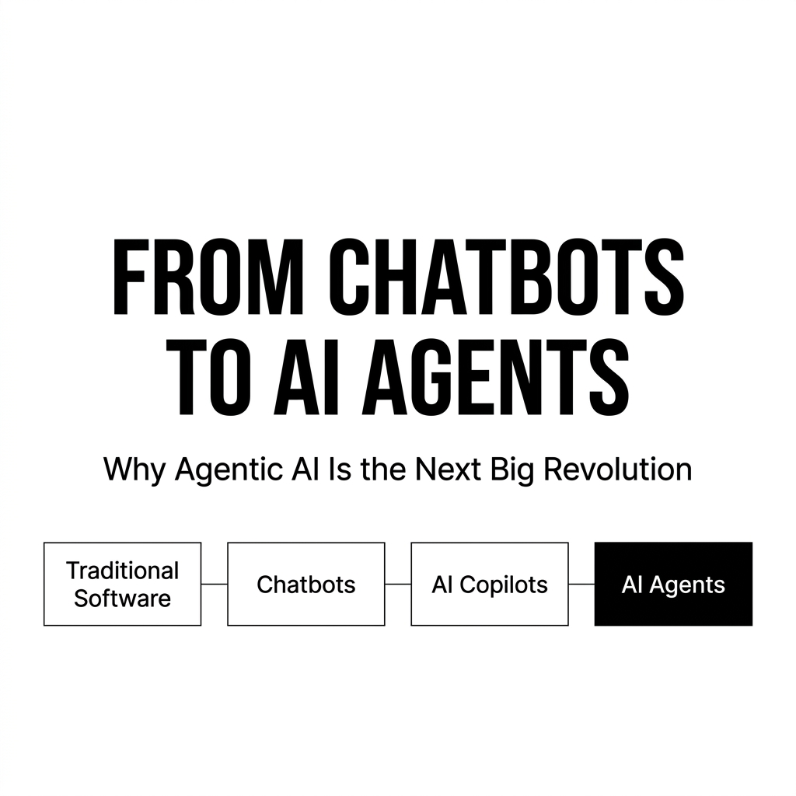
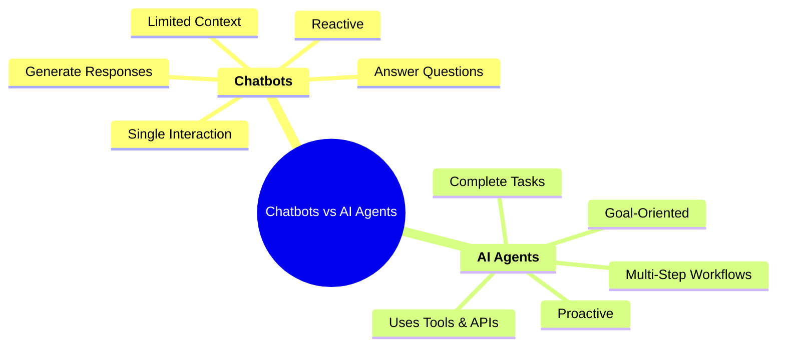
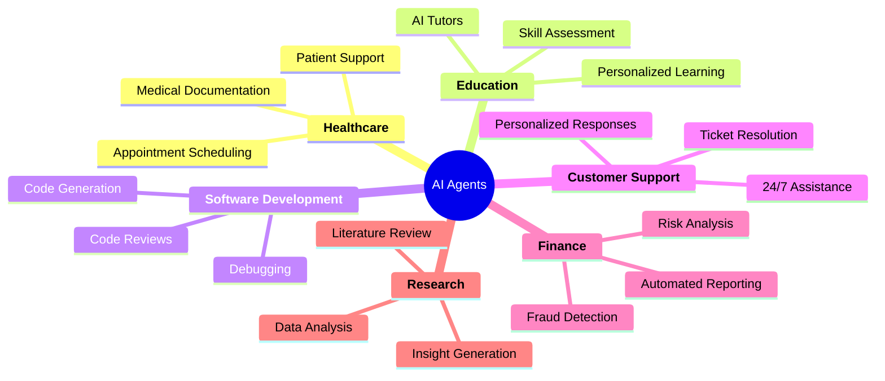

# From Chatbots to AI Agents: Why Agentic AI Is the Next Big Revolution

  

 

*Read the original article on [Medium](https://medium.com/@aditya-forge/from-chatbots-to-ai-agents-why-agentic-ai-is-the-next-big-revolution-64257336f3b9).*

---

## Introduction

Artificial Intelligence has transformed the way we interact with technology. From generating content and writing code to answering complex questions, AI-powered chatbots have become an integral part of our daily lives.

**But now, a new revolution is just beginning—one that is all about AI Agents.**

AI agents are fundamentally different from traditional chatbots because they can think and act on their own. They don't just answer questions; they can also make plans, use tools, and make decisions without much help from humans. This means they can complete complex, multi-step tasks autonomously with minimal supervision. The main goal of AI agents is to achieve specific objectives, not just respond to what you ask them.

> This shift from conversational AI to autonomous AI systems is expected to redefine how businesses operate, how software is built, and how humans collaborate with machines.

In this article, we'll explore what AI agents are, how they differ from chatbots, and why many experts believe Agentic AI is the next major revolution in artificial intelligence.

---

## What Are AI Agents?

**AI agents** are intelligent systems designed to achieve specific goals with minimal human intervention. Unlike traditional chatbots that simply generate responses to prompts, AI agents can plan tasks, make decisions, use external tools, and adapt their actions based on changing conditions.

Think of a chatbot as someone who answers your questions. An AI agent, on the other hand, acts like a digital assistant that can understand an objective and work toward completing it.

For example, instead of simply explaining *how* to book a flight, an AI agent could compare prices, select suitable options, make reservations, and notify you of updates—all while following your specific preferences.

This ability to reason, act, and learn from feedback makes AI agents one of the most promising advancements in modern artificial intelligence.

  
   
  <i>Figure 1: Workflow of an AI agent—from understanding a goal to planning, taking action, and evaluating results.</i>

---

## How Do AI Agents Differ From Chatbots?

Although AI chatbots and AI agents are often discussed together, they serve very different purposes.

- **Chatbots** are primarily designed for conversation. They respond to questions, generate content, and provide information based on the prompts they receive. Their interaction usually begins and ends with a user's request.
- **AI Agents** take it to the next level. They don't just respond; they actively work towards goals, complete multi-step tasks, and interact with other tools and systems. Furthermore, they can analyze information, make choices, and adapt their approach based on new data.

<i>Figure 2: Chatbots respond to prompts, whereas AI agents can reason, plan, and take actions to achieve objectives.</i>

**Let's look at an example:**
If you need to send an email, a chatbot can help you write it. However, an AI agent can write the email, figure out who to send it to, decide the optimal time to send it, and monitor for a response. If there is no reply, the agent can automatically draft and send a follow-up email.

> The shift from answering questions to completing tasks is what makes Agentic AI such a transformative technology. The future of AI is not about generating better answers—it's about accomplishing meaningful goals.

---

## Real-World Applications of AI Agents

AI is increasingly being deployed across various fields to streamline workflows and boost efficiency. Because AI agents can handle complex tasks autonomously, they are revolutionizing how businesses operate:

*   **Customer Support:** AI agents can handle inquiries, resolve common issues, escalate complex cases, and provide personalized assistance around the clock.
*   **Software Development:** In the world of software engineering, AI agents are making a massive impact. They can generate code, identify and fix bugs, review pull requests, and even manage entire development workflows.
*   **Business Operations:** Companies leverage AI to analyze market trends, process data, generate reports, manage inboxes, and automate repetitive processes. This frees up human employees to focus on high-value, strategic work that requires a human touch.
*   **Healthcare:** Healthcare organizations are exploring AI agents to assist with appointment scheduling, patient communication, medical documentation, and administrative operations.

<i>Figure 3: Real-world applications of AI agents across industries, highlighting their growing role in automation, decision-making, and productivity enhancement.</i>

As AI technology continues to advance, the range of applications for autonomous agents is expected to grow significantly, making them a foundational component of future digital ecosystems.

---

## Benefits and Challenges of Agentic AI

Just like any transformative technology, Agentic AI offers immense benefits but also introduces new challenges that must be addressed.

### 🌟 Benefits
1. **Automation and Efficiency:** Agents automate repetitive and time-consuming tasks, allowing humans to focus on creativity, strategy, and decision-making. They can work 24/7, process massive datasets, and drastically improve process efficiency.
2. **Scalability:** A single AI system can assist millions of users simultaneously, making it highly valuable for enterprises and global platforms.

### ⚠️ Challenges and Concerns
1. **Risk of Errors:** Autonomous decision-making increases the chance of mistakes if instructions are unclear, edge cases arise, or data is incomplete.
2. **Security and Privacy:** There are valid concerns regarding the protection of personal information and safeguarding these autonomous systems against cyberattacks.
3. **Ethics and Fairness:** We must ensure these systems are fair and non-discriminatory, and establish clear accountability when things go wrong.
4. **Governance:** Robust rules and human oversight are necessary to ensure safe operations. The ultimate goal is human-AI collaboration, not human replacement.

As Agentic AI becomes more widespread, balancing rapid innovation with responsible governance will be essential.

---

## The Future of Agentic AI

The future of artificial intelligence is moving definitively beyond conversation and toward autonomous action. As AI models become more capable and reliable, agents will play an increasingly vital role in both personal and professional environments.

In the coming years, we can expect AI agents to collaborate seamlessly with humans on complex tasks, orchestrate workflows across multiple applications, and provide assistance in areas ranging from education and healthcare to finance and software development.

Emerging technologies—such as multi-agent systems, advanced reasoning models, and standardized agent protocols—will further expand the capabilities of autonomous AI. Instead of interacting with a single AI assistant, users may soon rely on teams of specialized AI agents collaborating to achieve grand objectives.

While there are still significant hurdles to overcome regarding trust, governance, and ethics, the trajectory is clear: AI is evolving into a proactive system that actively assists us in achieving our goals.

---

## Conclusion

The transition from chatbots to AI agents represents one of the most significant paradigm shifts in the history of artificial intelligence. While chatbots changed how we access information, AI agents are changing how work gets done.

By combining reasoning, planning, and autonomous action, agentic systems have the potential to transform industries, multiply productivity, and redefine the relationship between humans and technology.

The question is no longer *whether* AI agents will become mainstream, but *how quickly* they will reshape the way we work, build, and innovate. The age of Agentic AI has begun, and those who understand it today will be best prepared for the opportunities of tomorrow.
